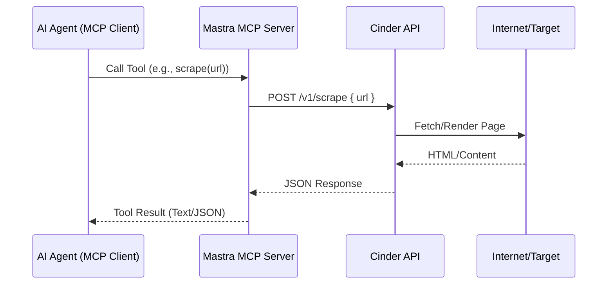

# Architecture

The Mastra MCP integration consists of two main components: the existing Cinder backend and the new Mastra MCP Server.

## Components

### 1. Cinder Backend (Existing)

- **Technology**: Go (Gin framework)
- **Role**: Core logic for scraping, crawling, and searching.
- **API**: Exposes HTTP endpoints (`/v1/scrape`, `/v1/search`, `/v1/crawl`).
- **Dependencies**: Redis (for crawling queue), Browser (for dynamic rendering).

### 2. Mastra MCP Server (New)

- **Technology**: Node.js / TypeScript (Mastra framework)
- **Role**: Acts as an intermediary between MCP Clients (AI Agents) and Cinder.
- **Functionality**:
  - Defines MCP Tools (`scrape`, `search`, `crawl`).
  - Translates MCP tool calls into HTTP requests to Cinder.
  - Formats Cinder responses back to MCP compatible results.

## Data Flow

## Deployment

The Mastra app should run alongside the Cinder API. In a production environment, both can be containerized and orchestrated via Docker Compose.
